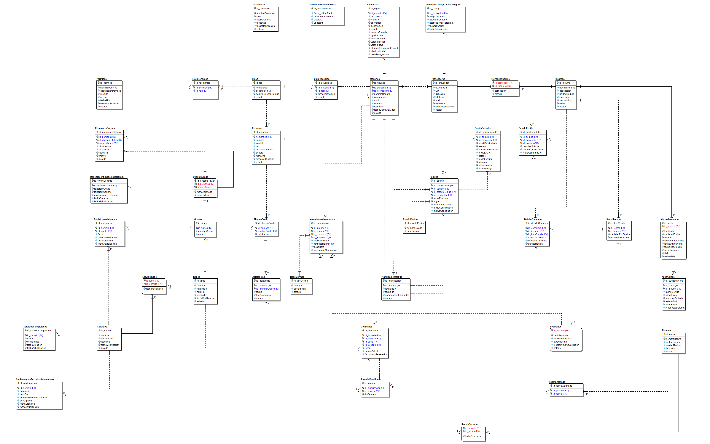

# Proyecto-Software-2025

Desarrollo de un sistema de gestión para el comedor de una escuela primaria. El
proyecto busca optimizar la administración de menús, el control de inventario y
el registro de alumnos.

# Sistema de Gestión de Comedor Escolar

# Backend

## 📋 Descripción

Sistema web completo para la gestión integral de un comedor escolar,
desarrollado con **Node.js v22.12.0**, **Express v5.1.0** y **MySQL 8.0.42**.
Permite administrar inventarios, planificar menús, controlar asistencias y
generar reportes detallados del funcionamiento del comedor.

## 🎯 Características Principales

- **Gestión de Usuarios y Roles**: Sistema de autenticación con roles
  diferenciados (Administrador, Cocinero, Encargado de Inventario, Docente,
  Supervisor)
- **Control de Inventario**: Seguimiento en tiempo real de insumos, stock mínimo
  y movimientos
- **Planificación de Menús**: Creación y gestión de recetas con cálculo
  automático de ingredientes
- **Registro de Asistencias**: Control diario de asistencia por grado y tipo de
  servicio
- **Gestión de Proveedores**: Administración de proveedores y pedidos de insumos
- **Auditoría Completa**: Registro detallado de todas las operaciones del sistema
- **Reportes y Estadísticas**: Generación de reportes de consumo, inventario y
  costos

## 🛠️ Tecnologías Utilizadas

- **Backend**: Node.js, Express.js
- **Base de Datos**: MySQL/MariaDB
- **Autenticación**: JWT (JSON Web Tokens)
- **Encriptación**: bcrypt para contraseñas
- **Arquitectura**: API RESTful
- **Identificadores**: UUID para integridad de datos

## 📊 Estructura de la Base de Datos

El sistema cuenta con 15+ tablas relacionales que gestionan:

- Seguridad y usuarios
- Inventario y recetas
- Abastecimiento y proveedores
- Flujo operacional (consumos)
- Control y trazabilidad

## 🚀 Instalación y Uso

### Requisitos Previos

- **Node.js**: v18.0.0 o superior
- **npm** o **pnpm**: Gestor de paquetes
- **MySQL**: v8.0 o superior
- **Git**: Para clonar el repositorio

### Pasos de Instalación

#### 1. Instalar Dependencias

```bash
cd server
pnpm install
```

#### 2. Configurar Variables de Entorno

Crear archivo `.env` en la carpeta `server/`:

```env
# Base de Datos
DB_HOST=localhost
DB_USER=root
DB_PASSWORD=tu_contraseña
DB_NAME=comedor_escolar
DB_PORT=3306

# Servidor
PORT=5000
NODE_ENV=development

# JWT
JWT_SECRET=tu_clave_secreta_jwt_muy_segura_32_caracteres_minimo
JWT_EXPIRE=7d

# Telegram Bot (Opcional - para alertas de inventario)
TELEGRAM_BOT_TOKEN=123456:ABC-DEF1234ghIkl-zyx57W2v1u123ew11
TELEGRAM_CHAT_ID=-1001234567890
TELEGRAM_BOT_USERNAME=Comedor_Escolar_Bot

# Email Service (Opcional - para notificaciones por email)
MAILTRAP_TOKEN=tu_token_mailtrap
MAILTRAP_FROM_EMAIL=noreply@comedor.escolar

# Entorno
CORS_ORIGIN=http://localhost:5173
```

#### 3. Configurar Base de Datos

```bash
# Crear base de datos
mysql -u root -p < server/sql/create_database.sql

# Cargar estructura de tablas
mysql -u root -p comedor_escolar < server/sql/schema.sql

# Cargar datos iniciales (opcional)
mysql -u root -p comedor_escolar < server/sql/seed_data.sql
```

#### 4. Iniciar el Servidor

```bash
cd server

# En modo desarrollo (con reinicio automático)
pnpm run dev

# En modo producción
pnpm start
```

El servidor estará disponible en `http://localhost:5000`

### Verificación de la Instalación

```bash
# Probar endpoint de salud
curl http://localhost:5000/api/health

# Ver logs del servidor
# Los logs deben mostrar: "✅ Servidor ejecutándose en puerto 5000"
```

## 📁 Estructura del Proyecto del Servidor

```
├── server/
│   ├── tests/           # Suite de pruebas de integración de endpoints (Vitest + Supertest)
│   │   ├── grados.test.js   # Casos de prueba para la gestión de grados
│   │   ├── personas.test.js # Casos de prueba para el ciclo de vida de usuarios y datos personales
│   │   ├── proveedores.test.js # Validación de lógica de negocio y endpoints de proveedores
│   │   ├── recetas.test.js  # Pruebas funcionales sobre el módulo de recetas y fórmulas de cocina
│   │   └── usuarios.test.js # Pruebas para la autenticación, roles y perfiles
│   ├── controllers/         # Controladores encargados de procesar las peticiones HTTP y orquestar la lógica de negocio
│   ├── middleware/          # Middlewares globales y locales (Autenticación JWT, validación de roles y manejo de errores)
│   ├── models/              # Capa de persistencia y modelos de datos (Abstracción de consultas a la base de datos)
│   ├── routes/              # Definición de las rutas/endpoints de la API RESTful expuestos para el cliente
│   ├── schemas/             # Esquemas de validación estructural de datos a nivel de aplicación (ej. Zod o Joi)
│   ├── services/            # Módulos de servicios externos y mensajería automatizada (Mailtrap para correos y bots de Telegram)
│   ├── sql/                 # Scripts, respaldos, esquemas de inicialización y queries puras de la base de datos SQL
│   ├── utils/               # Funciones utilitarias del backend, formateadores y herramientas de criptografía (ej. Bcrypt)
│   ├── app.js               # Configuración centralizada de Express (Middlewares, rutas base, CORS y políticas de seguridad)
│   ├── package.json         # Manifesto del servidor, dependencias de producción/desarrollo y scripts de inicialización
│   ├── server-whit-mysql.js # Punto de entrada principal (Entry point) que levanta el servidor e inicializa la conexión a MySQL
│   ├── utils.js             # Funciones auxiliares globales para la raíz del backend
│   └── vitest.config.js     # Configuración del entorno de pruebas automatizadas del servidor
└── README.md
```

## 👥 Roles del Sistema

### Descripción de Roles

**Administrador**

- Acceso completo al sistema
- Gestión de usuarios, roles y permisos
- Gestión de alumnos, docentes y grados
- Gestión de insumos y proveedores
- Auditoría y reportes del sistema
- Configuración de parámetros del sistema

**Cocinero/Cocinera**

- Gestión de recetas e ingredientes
- Planificación de menús por servicio y fecha
- Control de asistencias de alumnos
- Gestión de inventario
- Registro de consumos
- Generación de pedidos de insumos
- Visualización de estadísticas y reportes
- Recepción de alertas de bajo stock

**Docente**

- Registro de asistencia diaria de alumnos
- Visualización de información del grado
- Acceso a reportes de asistencia

**Supervisor**

- Acceso a reportes y estadísticas
- Monitoreo de inventario
- Generación de informes

**Encargado de Inventario**

- Gestión completa de inventario
- Control de movimientos
- Gestión de mermas
- Seguimiento de stock

## 🔒 Seguridad

- Autenticación JWT con tokens con expiración
- Encriptación de contraseñas con bcrypt (10 rondas)
- Control de acceso basado en roles (RBAC)
- Validación de datos de entrada en nivel de esquema
- Auditoría completa de operaciones
- Headers de seguridad HTTP
- Rate limiting para endpoints críticos
- CORS configurado por dominio

## 🔌 Endpoints Principales de la API

### Autenticación

```
POST   /api/auth/login              # Login de usuario
POST   /api/auth/logout             # Logout
POST   /api/auth/refresh            # Refrescar token JWT
```

### Usuarios

```
GET    /api/usuarios                # Listar usuarios
POST   /api/usuarios                # Crear usuario
GET    /api/usuarios/:id            # Obtener usuario
PUT    /api/usuarios/:id            # Actualizar usuario
DELETE /api/usuarios/:id            # Eliminar usuario
```

### Inventario

```
GET    /api/insumos                 # Listar insumos
POST   /api/insumos                 # Crear insumo
PUT    /api/insumos/:id             # Actualizar insumo
GET    /api/inventarios             # Listar inventario
POST   /api/movimientos-inventarios # Registrar movimiento
GET    /api/alertas-inventario      # Obtener alertas
```

### Recetas y Menús

```
GET    /api/recetas                 # Listar recetas
POST   /api/recetas                 # Crear receta
PUT    /api/recetas/:id             # Actualizar receta
GET    /api/planificacion-menus     # Listar planificaciones
POST   /api/planificacion-menus     # Crear planificación
PUT    /api/planificacion-menus/:id # Actualizar planificación
```

### Asistencias

```
POST   /api/asistencias             # Registrar asistencia
GET    /api/asistencias             # Obtener asistencias
PATCH  /api/asistencias/:id         # Actualizar tipo asistencia
```

### Pedidos y Proveedores

```
GET    /api/pedidos                 # Listar pedidos
POST   /api/pedidos                 # Crear pedido
GET    /api/proveedores             # Listar proveedores
POST   /api/proveedores             # Crear proveedor
```

### Alertas Telegram

```
POST   /api/telegram/enviar-alerta  # Enviar alerta manual
GET    /api/telegram/status         # Verificar estado bot
```

Todos los endpoints están protegidos con autenticación JWT excepto `/api/auth/login`.

Proyecto en desarrollo activo con funcionalidades core implementadas y en
proceso de testing.

# Frontend

## 📋 Descripción

Interfaz web moderna y responsiva para la gestión del comedor escolar, desarrollada con **React 18.3.1** y **Vite 7.1.12**. Proporciona una experiencia de usuario intuitiva para los diferentes roles del sistema, con dashboards personalizados, gráficos estadísticos interactivos y formularios validados.

## 🛠️ Tecnologías Utilizadas

### Core

- **React 18.3.1**: Framework de UI interactivo
- **Vite 7.1.12**: Bundler y servidor de desarrollo
- **React Router v6.28**: Navegación y enrutamiento
- **Axios**: Cliente HTTP para comunicación con API

### Visualización de Datos

- **Chart.js 4.5.1**: Librería de gráficos
- **react-chartjs-2 5.3.1**: Integración de Chart.js con React
- **html2canvas 1.4.1**: Captura de elementos HTML
- **jsPDF 3.0.4**: Generación de reportes en PDF
- **jspdf-autotable 5.0.2**: Generación de tabla en PDF
- **sweetalert2 11.26.17 **: Mensaje de alerta

### UI y Estilos

- **Bootstrap 5.3**: Framework CSS
- **Font Awesome 7.1.0**: Iconografía
- **CSS personalizado**: Estilos específicos de la aplicación

### Validación y Formularios

- **ESLint**: Linting de código JavaScript

## 🎯 Características del Frontend

- **Dashboard Personalizado**: Vistas diferentes según rol del usuario
- **Gestión de Inventario**: Tabla interactiva con búsqueda y filtros
- **Planificación de Menús**: Calendario visual para asignar recetas por servicio
- **Control de Asistencias**: Interfaz para marcar asistencia de alumnos
- **Estadísticas Avanzadas**: 5 tipos de gráficos con opciones de filtrado
- **Generación de Reportes**: Exportación a PDF con gráficos incluidos
- **Modo Responsivo**: Adaptable a diferentes tamaños de pantalla
- **Sistema de Alertas**: Notificaciones de bajo stock via Telegram

## 📊 Estructura del Proyecto Frontend

```
client/
│
├── coverage/                    # Reportes de cobertura de código generados automáticamente por Vitest
│   ├── components/              # Cobertura detallada de componentes de la interfaz (.html interactivos)
│   │   ├── auth/                # Reportes del flujo de autenticación (Cambio de contraseña, recuperación)
│   │   │   ├── ChangePassword.jsx.html
│   │   │   ├── ForgotPassword.jsx.html
│   │   │   └── index.html
│   │   ├── ErrorBoundary.jsx.html # Cobertura del capturador de errores globales de renderizado
│   │   ├── index.jsx.html       # Reporte consolidado de componentes de raíz
│   │   ├── Navbar.jsx.html      # Cobertura de la barra de navegación principal
│   │   └── ProtectedRoute.jsx.html # Cobertura de la lógica de guardianes de rutas
│   ├── pages/                   # Reportes de cobertura correspondientes a las vistas generales
│   │   └── auth/                # Cobertura del flujo de inicio de sesión
│   │       ├── index.html
│   │       └── Login.jsx.html
│   └── styles/                  # Cobertura técnica asociada al mapeo estructural de estilos
│       ├── ChangePassword.jsx.html
│       ├── ForgotPassword.jsx.html
│       └── index.html
├── public/                      # Archivos estáticos y assets globales (imágenes, favicons)
├── src/
│   ├── components/              # Componentes reutilizables de la interfaz organizados por módulos de rol
│   │   ├── admin/               # Formularios, modales y barras laterales del rol Administrador
│   │   │   ├── AlumnoGradoForm.jsx
│   │   │   ├── AsignarInsumosForm.jsx
│   │   │   ├── AsignarPermisosForm.jsx
│   │   │   ├── AditoriaDetalle.jsx
│   │   │   ├── AuditoriaForm.jsx
│   │   │   ├── AuditoriaInforme.jsx
│   │   │   ├── ChatIdDocenteForm.jsx
│   │   │   ├── ChatIDProveedorForm.jsx
│   │   │   ├── DocenteGradoForm.jsx
│   │   │   ├── EstadoPedidoForm.jsx
│   │   │   ├── GradoForm.jsx
│   │   │   ├── InsumoForm.jsx
│   │   │   ├── ParametrosForm.jsx
│   │   │   ├── PermisoForm.jsx
│   │   │   ├── PersonaEditForm.jsx
│   │   │   ├── PersonaForm.jsx
│   │   │   ├── ProveedorForm.jsx
│   │   │   ├── ReemplazoDocenteForm.jsx
│   │   │   ├── RolForm.jsx
│   │   │   ├── ServicioForm.jsx
│   │   │   ├── Sidebar.jsx
│   │   │   ├── TelegramInstruccionsModal.jsx
│   │   │   ├── TipoMermaForm.jsx
│   │   │   ├── TurnoForm.jsx
│   │   │   └── UsuarioForm.jsx
│   │   ├── auth/                # Componentes para el flujo de recuperación y actualización de credenciales
│   │   │   ├── ChangePassword.jsx
│   │   │   └── ForgotPassword.jsx
│   │   ├── cocinera/            # Formularios de inventario, recetas y pedidos del rol Cocina
│   │   │   ├── CocineraSidebar.jsx
│   │   │   ├── MovimientosForm.jsx
│   │   │   ├── PedidoAutomaticoForm.jsx
│   │   │   ├── PedidoFormSimple.jsx
│   │   │   ├── PedidoVista.jsx
│   │   │   ├── PlanificacionMenuForm.jsx
│   │   │   ├── RecepcionInsumo.jsx
│   │   │   └── RecetaForm.jsx
│   │   ├── docente/             # Componentes específicos del rol de Docencia
│   │   │   └── DocenteSidebar.jsx
│   │   ├── proveedor/           # Gestión de catálogos e insumos del rol de Proveedores
│   │   │   ├── AddInsumosForm.jsx
│   │   │   └── ProveedorSidebar.jsx
│   │   ├── ConnectionStatus.jsx # Componente global para monitoreo del estado de red
│   │   ├── ErrorBoundary.jsx    # Límite de errores para mitigar colapsos en la UI
│   │   ├── Navbar.jsx           # Barra de navegación superior
│   │   ├── PrmisosProtegido.jsx # Componente de validación atómica de permisos
│   │   └── ProtectedRoute.jsx   # Middleware visual para protección de rutas según autenticación
│   ├── context/                 # Context API para la gestión del estado global de la aplicación
│   │   └── AuthContext.jsx      # Proveedor del estado de autenticación, usuarios y sesión activa
│   ├── hooks/                   # Custom Hooks para encapsular lógica y comportamiento reutilizable
│   │   └── usePermisos.js       # Hook para verificar y abstraer permisos de usuario en los componentes
│   ├── layouts/                 # Plantillas de diseño estructural de la página según el rol
│   │   ├── AdminLayout.jsx
│   │   ├── CocineroLayout.jsx
│   │   ├── DocenteLayout.jsx
│   │   └── ProveedorLayout.jsx
│   ├── pages/                   # Vistas/Páginas principales de la aplicación (enrutadas)
│   │   ├── admins/              # Dashboards, listados y configuraciones complejas del sistema
│   │   │   ├── Alertas.jsx
│   │   │   ├── Auditoria.jsx
│   │   │   ├── Configuracion.jsx
│   │   │   ├── ConfiguracionEscuela.jsx
│   │   │   ├── ConfiguracionServicio.jsx
│   │   │   ├── ConfiguracionTelegram.jsx
│   │   │   ├── Dashboard.jsx
│   │   │   ├── GeneracionAutomatica.jsx
│   │   │   ├── GestionRolesPermisos.jsx
│   │   │   ├── ListaAlumnoGrado.jsx
│   │   │   ├── ListaDocenteGrado.jsx
│   │   │   ├── ListaEstadoPedido.jsx
│   │   │   ├── ListaGrados.jsx
│   │   │   ├── ListaInsumos.jsx
│   │   │   ├── ListaReemplazoDocente.jsx
│   │   │   ├── ListaServicios.jsx
│   │   │   ├── ListaTipoMerma.jsx
│   │   │   ├── ListaTurnos.jsx
│   │   │   ├── Parametros.jsx
│   │   │   ├── ParametrosSistema.jsx
│   │   │   ├── PersonaGrado.jsx
│   │   │   ├── Personas.jsx
│   │   │   ├── Proveedores.jsx
│   │   │   └── Usuarios.jsx
│   │   ├── auth/                # Vista del formulario de Login de la aplicación
│   │   │   └── Login.jsx
│   │   ├── cocinera/            # Vistas de gestión de menús, pedidos, existencias e informes diarios
│   │   │   ├── CocineraDashboard.jsx
│   │   │   ├── CocineraGestionAsistencias.jsx
│   │   │   ├── CocineraInventario.jsx
│   │   │   ├── CocineraMenu.jsx
│   │   │   ├── CocineraMovimiento.jsx
│   │   │   ├── CocineraReceta.jsx
│   │   │   ├── CocineraTelegram.jsx
│   │   │   ├── CocineraTelegramExitoso.jsx
│   │   │   ├── Consumos.jsx
│   │   │   ├── ControlInventario.jsx
│   │   │   ├── Estadistica.jsx
│   │   │   ├── GestionAsistencias.jsx
│   │   │   ├── InsumosSemanal.jsx
│   │   │   ├── ListaAsistencia.jsx
│   │   │   ├── ListaAsistenciasService.jsx
│   │   │   ├── MenuesDiaria.jsx
│   │   │   ├── PedidoConfirmado.jsx
│   │   │   ├── PedidoInsumo.jsx
│   │   │   ├── Pedidos.jsx
│   │   │   ├── PlanificacionCalendario.jsx
│   │   │   ├── PlanificacionSemanal.jsx
│   │   │   └── Reportes.jsx
│   │   ├── docente/             # Vistas de toma de asistencia escolar, horarios y alumnos a cargo
│   │   │   ├── AsistenciaAlumno.jsx
│   │   │   ├── Calendario.jsx
│   │   │   ├── DocenteAsistencia.jsx
│   │   │   ├── DocenteDashboard.jsx
│   │   │   ├── Horarios.jsx
│   │   │   └── MisAlumnos.jsx
│   │   ├── movil/               # Vistas simplificadas optimizadas exclusivamente para dispositivos móviles
│   │   │   ├── RegistroAsistenciasMovil.jsx
│   │   │   └── RegistroExitoso.jsx
│   │   ├── proveedor/           # Vistas de recepción de pedidos de compra y confirmaciones de entrega
│   │   │   ├── ConfirmacionExitosa.jsx
│   │   │   ├── ConfirmacionProveedor.jsx
│   │   │   ├── GestionProductos.jsx
│   │   │   └── ProveedorPedidos.jsx
│   │   ├── NotFound.jsx         # Vista de error de ruta no encontrada (404)
│   │   └── TestPage.jsx         # Página sandbox/entorno de pruebas en desarrollo
│   ├── routes/                  # Configuración y definición de rutas del sistema
│   │   └── AppRoutes.jsx        # Enrutador principal mapeado con sus respectivos layouts y guards
│   ├── services/                # Capa de abstracción para el consumo e interacción de la API HTTP Restful
│   │   ├── alumnoGradoService.js
│   │   ├── api.js               # Instancia de comunicación core de la aplicación
│   │   ├── asistenciaService.js
│   │   ├── asistenciasService.js
│   │   ├── auditoriaService.js
│   │   ├── authService.js
│   │   ├── axiosConfig.js       # Interceptores HTTP para manejo automático de tokens y errores
│   │   ├── cacheService.js
│   │   ├── configService.js
│   │   ├── configServicioAutomaticoService.js
│   │   ├── consumosService.js
│   │   ├── docenteGradoService.js
│   │   ├── escuelaService.js
│   │   ├── estadoPedidoService.js
│   │   ├── generacionAutomaticaService.js
│   │   ├── gradoService.js
│   │   ├── insumoService.js
│   │   ├── inventarioService.js
│   │   ├── mockConsumos.js
│   │   ├── movimientoInventarioService.js
│   │   ├── pedidoService.js
│   │   ├── permisoService.js
│   │   ├── personaService.js
│   │   ├── planificacionMenuService.js
│   │   ├── planificacionServicioRecetaService.js
│   │   ├── proveedorInsumoService.js
│   │   ├── proveedorService.js
│   │   ├── recetaService.js
│   │   ├── reemplazoDocenteService.js
│   │   ├── rolPermisoService.js
│   │   ├── rolService.js
│   │   ├── servicioConfigService.js
│   │   ├── servicioService.js
│   │   ├── serviciosRecetasService.js
│   │   ├── servicioTurnoService.js
│   │   ├── tipoMermaService.js
│   │   ├── turnoService.js
│   │   └── usuarioService.js
│   ├── styles/                  # Hojas de estilo modulares basados en CSS Modules para evitar colisiones
│   │   ├── App.css              # Estilos comunes base de la app
│   │   ├── Auditoria.css
│   │   ├── Calendario.module.css
│   │   ├── CocineraInventario.module.css
│   │   ├── Componentes.module.css
│   │   ├── Confirmaciones.module.css
│   │   ├── ConnectionStatus.module.css
│   │   ├── ContenidoPage.module.css
│   │   ├── Dashboard.module.css
│   │   ├── Docente.module.css
│   │   ├── Estadistica.module.css
│   │   ├── Formulario.module.css
│   │   ├── ImpresionPDF.module.css
│   │   ├── index.css            # Inicialización de fuentes, resets y variables CSS
│   │   ├── Instrucciones.module.css
│   │   ├── Layouts.module.css
│   │   ├── Login.module.css
│   │   ├── Movil.module.css
│   │   ├── Parametros.module.css
│   │   ├── Pedido.module.css
│   │   └── Tabla.module.css
│   ├── test/                    # Suite completa de pruebas unitarias y de integración del Frontend
│   │   ├── components/          # Tests de comportamiento de componentes lógicos e interactivos
│   │   │   ├── auth/            # Casos de prueba para flujos de formularios de contraseñas
│   │   │   │   ├── ChangePassword.test.jsx
│   │   │   │   └── ForgotPassword.test.jsx
│   │   │   ├── ConnectionStatus.test.jsx # Test de simulación offline / online
│   │   │   ├── ErrorBoundary.test.jsx    # Test de captura e intercepción de errores de UI
│   │   │   ├── Navbar.test.jsx           # Test de renderizado y navegación
│   │   │   ├── NotFound.test.jsx         # Test de redirección por rutas inválidas
│   │   │   └── ProtectedRoute.test.jsx   # Test de aserciones de acceso no autorizado
│   │   ├── pages/               # Tests orientados a flujos completos en pantallas y páginas integradas
│   │   │   └── auth/
│   │   │       └── Login.test.jsx # Pruebas funcionales del ciclo de inicio de sesión con mocking HTTP
│   │   └── setup.js             # Archivo de configuración global de Testing Library, mocks globales y MSW
│   ├── utils/                   # Funciones puras auxiliares y formateadores utilitarios
│   │   ├── alertService.js
│   │   ├── dateUtils.js
│   │   ├── filterOptions.js
│   │   ├── formatCantidad.js
│   │   └── formatNumero.js
│   ├── App.jsx                  # Componente raíz integrador de la aplicación
│   └── main.jsx                 # Punto de entrada de renderizado de React en el DOM con modo estricto
├── eslint.config.js             # Configuración de linter para mantener la consistencia del código
├── index.html                   # Archivo HTML plantilla base para montar la aplicación SPA de Vite
├── package.json                 # Manifesto del proyecto, scripts de ejecución y dependencias declaradas
├── vite.config.js               # Configuración del empaquetador Vite
├── vitest.config.js             # Configuración del entorno de ejecución de pruebas automatizadas
└── README.md                    # Documentación técnica general del proyecto
```

## 🚀 Instalación y Configuración Completa

### Requisitos Previos

- **Node.js**: v18.0.0 o superior
- **npm** o **pnpm**: Gestor de paquetes
- **MySQL**: Servidor de base de datos
- **Git**: Control de versiones

### Pasos de Instalación

#### 1. Clonar el Repositorio

```bash
git clone <URL_REPOSITORIO>
cd Comedor
```

#### 2. Configurar el Backend

```bash
cd server
pnpm install
```

#### 3. Configurar Variables de Entorno (Backend)

Crear archivo `.env` en la carpeta `server/`:

```env
# Base de Datos
DB_HOST=localhost
DB_USER=root
DB_PASSWORD=tu_contraseña
DB_NAME=comedor_escolar
DB_PORT=3306

# Servidor
PORT=3000
NODE_ENV=development

# JWT
JWT_SECRET=tu_clave_secreta_jwt_muy_segura
JWT_EXPIRE=7d

# Telegram Bot (Opcional - para alertas)
TELEGRAM_BOT_TOKEN=tu_token_del_bot
TELEGRAM_CHAT_ID=tu_id_de_chat
TELEGRAM_BOT_USERNAME=nombre_del_bot

# Email Service (Opcional - para notificaciones)
MAILTRAP_TOKEN=tu_token_mailtrap
MAILTRAP_FROM_EMAIL=noreply@comedor.escolar
```

#### 4. Configurar Base de Datos

```bash
# Crear base de datos
mysql -u root -p < server/sql/create_database.sql

# Cargar estructura
mysql -u root -p comedor_escolar < server/sql/schema.sql

# Cargar datos iniciales (opcional)
mysql -u root -p comedor_escolar < server/sql/seed_data.sql
```

#### 5. Iniciar Backend

```bash
cd server
pnpm start
# o para desarrollo con reinicio automático:
pnpm run dev
```

El servidor estará disponible en `http://localhost:5000`

#### 6. Configurar el Frontend

```bash
cd client
pnpm install
```

#### 7. Iniciar Frontend

```bash
cd client
pnpm run dev
```

La aplicación estará disponible en `http://localhost:5173`

---

## 🤖 Integración con Telegram

### Configuración Requerida

La aplicación incluye soporte para notificaciones automáticas via Telegram cuando el stock de insumos cae por debajo de los límites establecidos.

#### Paso 1: Crear un Bot de Telegram

1. Abrir Telegram y buscar `@BotFather`
2. Escribir `/start` y seguir las instrucciones
3. Usar `/newbot` para crear un nuevo bot
4. Guardar el token recibido

#### Paso 2: Obtener el Chat ID

1. Crear un grupo en Telegram o usar chat privado
2. Invitar al bot al grupo
3. Enviar cualquier mensaje
4. Usar este endpoint para obtener el Chat ID:

```bash
curl "https://api.telegram.org/bot<TOKEN>/getUpdates"
```

Buscar el campo `"id"` en la respuesta (será el Chat ID)

#### Paso 3: Configurar Variables de Entorno

Agregar al archivo `.env` del backend:

```env
TELEGRAM_BOT_TOKEN=123456:ABC-DEF1234ghIkl-zyx57W2v1u123ew11
TELEGRAM_CHAT_ID=-1001234567890
TELEGRAM_BOT_USERNAME=Comedor_Escolar_Bot
```

#### Paso 4: Usar Alertas en la Aplicación

Las alertas se generan automáticamente cuando:

- El stock de un insumo cae por debajo del mínimo
- Se realiza un consumo que afecta el stock mínimo
- Se registra un movimiento de inventario

**Ejemplo de alerta:**

```
🚨 ALERTA DE INVENTARIO 🚨

Insumo: Arroz Blanco
Stock Actual: 5 kg
Stock Mínimo: 10 kg

⚠️ El inventario está por debajo del nivel mínimo
```

---

## 🔐 Autenticación y Roles

### Credenciales de Prueba

```
ADMINISTRADOR:
  Usuario: admin@escuela.com
  Contraseña: Admin123!

COCINERO:
  Usuario: cocinero@escuela.com
  Contraseña: Cocinero123!

DOCENTE:
  Usuario: docente@escuela.com
  Contraseña: Docente123!
```

### Permisos por Rol

| Funcionalidad           | Admin | Cocinera | Docente | Proveedor |
| ----------------------- | ----- | -------- | ------- | --------- |
| Gestión de Usuarios     | ✅    | ❌       | ❌      | ❌        |
| Gestión de Insumos      | ✅    | ✅       | ❌      | ❌        |
| Planificación de Menús  | ❌    | ✅       | ❌      | ❌        |
| Registro de Asistencias | ❌    | ✅       | ✅      | ❌        |
| Inventario              | ✅    | ✅       | ❌      | ❌        |
| Reportes y Estadísticas | ❌    | ✅       | ❌      | ❌        |
| Gestión de Pedidos      | ❌    | ✅       | ❌      | ✅        |

---

## 📈 Funcionalidades Principales del Frontend

### 1. Planificación de Menús

- Calendario interactivo por semana
- Asignación de recetas por servicio (Desayuno, Almuerzo, Merienda)
- Bloqueado de fechas fuera del rango de planificación
- Vista de comensales por servicio y día
- Eliminación de menús asignados

### 2. Gestión de Recetas

- CRUD completo de recetas
- Selección de servicios aplicables
- Definición de ingredientes con cantidades
- Búsqueda y filtrado por nombre

### 3. Control de Asistencias

- Marcado de asistencia por grado y fecha
- Cambio dinámico entre estados (Presente, No confirmado, Ausente)
- Visualización de comensales por servicio
- Generación automática de enlaces de asistencia

### 4. Inventario

- Tabla interactiva de insumos
- Búsqueda y filtrado
- Stock mínimo alertas
- Movimientos de inventario
- Control de mermas

### 5. Estadísticas y Reportes

- Gráfico de consumos por día (Línea)
- Gráfico de asistencias (Doughnut)
- Consumo por servicio (Barras)
- Distribución de inventario (Pie)
- Top 5 insumos más consumidos (Barras Horizontales)
- Filtro por rango de fechas
- Exportación a PDF con gráficos

### 6. Gestión de Pedidos

- Creación de pedidos de insumos
- Seguimiento del estado
- Recepción de mercadería

---

## 🧪 Testing y Desarrollo

Para correr los tests localmente, asegúrate de instalar las dependencias y ejecutar:

### Frontend

```bash
cd client
pnpm run test    # o el comando que uses para vitest en el frontend
```

### Backend

```bash
cd server
pnpm run test    # o el comando que uses para vitest en el backend
```

### Ejecutar en Modo Desarrollo

Backend:

```bash
cd server
pnpm run dev
```

Frontend:

```bash
cd client
pnpm run dev
```

### Linting

Frontend:

```bash
cd client
pnpm run lint
```

---

## 🐛 Solución de Problemas Comunes

### Error de Conexión a Base de Datos

```
Error: connect ECONNREFUSED 127.0.0.1:3306
```

**Solución:**

- Verificar que MySQL esté ejecutándose
- Revisar credenciales en `.env`
- Confirmar que la base de datos existe

### Error CORS en el Frontend

```
Access to XMLHttpRequest has been blocked by CORS policy
```

**Solución:**

- Verificar que el backend está ejecutándose en `http://localhost:3000`
- Revisar configuración de CORS en `server/middlewares/cors.js`
- Reiniciar el servidor backend

### No se reciben notificaciones de Telegram

**Checklist:**

- Verificar que `TELEGRAM_BOT_TOKEN` sea válido
- Confirmar que `TELEGRAM_CHAT_ID` sea correcto
- Revisar logs: `console.error` en `telegramController.js`
- Bot debe estar añadido al grupo/chat

---

## 📝 Scripts Útiles

### Backend

```bash
# Desarrollo con reinicio automático
pnpm run dev

# Iniciar en producción
pnpm start

# Ejecutar linting
pnpm run lint
```

### Frontend

```bash
# Desarrollo con hot reload
pnpm run dev

# Build para producción
pnpm run build

# Preview de build
pnpm run preview

# Linting
pnpm run lint
```

---

## 📚 Documentación Adicional

- **API REST**: Documentación en `server/README.md`
- **Estructura BD**: Schema en `server/sql/schema.sql`
- **Endpoints**: Disponibles en `server/routes/`

---

## 📞 Contacto y Soporte

Para reportar bugs o sugerencias, contactar al equipo de desarrollo.

---

## 📄 Licencia

Proyecto desarrollado para propósitos educativos y de gestión escolar.

---

## 📈 Estado del Proyecto

Proyecto en desarrollo activo con funcionalidades core implementadas y testeado con vitest, supertest, etc.

### ✅ Funcionalidades Completadas

**Backend:**

- ✅ Sistema de autenticación y autorización JWT
- ✅ CRUD completo de usuarios, roles y permisos
- ✅ Gestión de inventario con alertas automáticas
- ✅ Planificación de menús con tabla intermedia RecetaServicio
- ✅ Control de asistencias con generación de enlaces
- ✅ Sistema de pedidos de insumos
- ✅ Integración con Telegram para alertas de bajo stock
- ✅ Validación de datos con schemas aplicación
- ✅ Auditoría completa de operaciones
- ✅ Manejo de errores mejorado con mensajes específicos
- ✅ Cascading deletes en relaciones complejas

**Frontend:**

- ✅ Interfaz de login con autenticación JWT
- ✅ Dashboard personalizado por rol (Admin, Cocinero, Docente)
- ✅ Gestión completa de usuarios y roles con permisos
- ✅ CRUD de alumnos, docentes, grados
- ✅ CRUD de insumos, proveedores y servicios
- ✅ Planificación visual de menús con calendario interactivo
- ✅ Bloqueo de fechas fuera de rango de planificación
- ✅ Control de asistencias con cambio de tipos (Si/No/Ausente)
- ✅ Dashboard de estadísticas con 5 tipos de gráficos
- ✅ Exportación de reportes a PDF con gráficos incluidos
- ✅ Interfaz responsiva con Bootstrap 5
- ✅ Alertas de bajo stock en tiempo real
- ✅ Búsqueda y filtrado en tablas
- ✅ Validación de formularios

**Última actualización:** Julio 09, 2026

---

## 🛢️ Modelo Entidad Relación - Base de Datos


